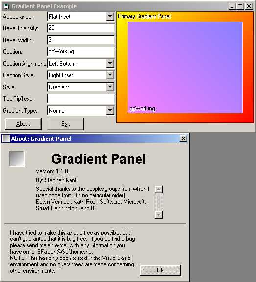



## Gradient Panel v1\.1\.0

### Description

This is a custom container control which is designed to act as an enhanced container that a designer can use in place of VB's Frame control. It includes several caption styles, appearances, control styles, and caption alignments. I've tried to make this as bug free as possible, but I can't guarantee that it is. If you have any problems please contact me and I'll try to help you through the problem as best I can.

Release 1.1.0:

+ New:

- Added Elliptical and Box Gradients

- Added Caption Alignment Cushion (Almost like margins)

- Added BackGround/Control Autosizing (Picture Mode)

- Added HSL Gradient Blending (Thanks Ulli & Edwin Vermeer)

- Added Gradient Repetitions (Thanks Edwin Vermeer)

+ Fixed:

- Bug in Enabled Property (Design Mode, Control would appear enabled even though control was disabled after a form with control on it was closed then re-opened)

- Bug in scaling that would cause the button to crash when placed on a parent that did not have ScaleMode available (PictureBox on an MDI form, etc...). Now if Parent.ScaleMode is not available button will scale co-ordinates to Twips
 
### More Info
 

             |
---                |---
**Submitted On**   |2001-05-02 06:48:10
**By**             |[Stephen Kent](https://github.com/Planet-Source-Code/PSCIndex/blob/master/ByAuthor/stephen-kent.md)
**Level**          |Advanced
**User Rating**    |4.4 (44 globes from 10 users)
**Compatibility**  |VB 6\.0
**Category**       |[Custom Controls/ Forms/  Menus](https://github.com/Planet-Source-Code/PSCIndex/blob/master/ByCategory/custom-controls-forms-menus__1-4.md)
**World**          |[Visual Basic](https://github.com/Planet-Source-Code/PSCIndex/blob/master/ByWorld/visual-basic.md)
**Archive File**   |[Gradient P191355320\.zip](https://github.com/Planet-Source-Code/stephen-kent-gradient-panel-v1-1-0__1-22841/archive/master.zip)

